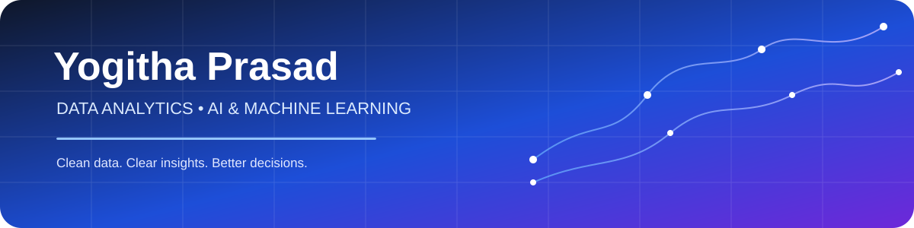

 

 

<table>
<tr>
<td width="62%" valign="top">

👋 Hello, I'm Yogitha

I'm an Artificial Intelligence & Machine Learning engineering student with a strong interest in Data Analytics, Business Intelligence and Machine Learning.

I enjoy turning messy datasets into something people can actually understand and use.

✦ What I enjoy

📊 Data analysis & exploratory data analysis

📈 Interactive dashboards & data storytelling

🐍 Python & SQL

📑 Excel & Power BI

📉 Statistical analysis & hypothesis testing

🤖 Machine Learning, NLP & sentiment analysis

🩻 Computer Vision & YOLOv8

🧹 Data cleaning & transformation

🚀 Learning by building practical projects

</td>

<td width="38%" valign="top">

🎯 My Focus

DATA ANALYTICS
████████████████████

DATA VISUALIZATION
███████████████████░

SQL
██████████████████░░

MACHINE LEARNING
████████████████░░░░

COMPUTER VISION
██████████████░░░░░░

NLP
█████████████░░░░░░░

</td>
</tr>
</table>

🧰 Tech Stack

💻 Languages & Data

📊 Analytics & Visualization

🐍 Python Libraries

🤖 AI / ML

Classification · Regression · NLP · Sentiment Analysis · Computer Vision · Object Detection · Statistical Analysis

🔧 Tools & Platforms

🚀 Featured Projects

<table>
<tr>
<td width="50%" valign="top">

🩻 CliniScan

Lung Abnormality Detection

Computer-vision project for detecting lung abnormalities in chest X-rays using YOLOv8.

Python · YOLOv8 · OpenCV · pydicom

View Repository →

</td>

<td width="50%" valign="top">

📊 Executive Sales Performance

Power BI Dashboard

Interactive analytics dashboard with DAX measures, YoY growth and profit-margin analysis.

Power BI · DAX · Data Visualization

View Repository →

</td>
</tr>

<tr>
<td width="50%" valign="top">

🗄️ Nashville Housing

SQL Data Cleaning

Cleaned and transformed 56K property records using CTEs, self-joins and window functions.

SQL · MySQL · Data Cleaning

View Repository →

</td>

<td width="50%" valign="top">

🧪 E-commerce A/B Testing

Statistical Analysis

Analysed website performance using Z-tests, probability concepts and logistic regression.

Python · Statistics · Regression

View Repository →

</td>
</tr>

<tr>
<td width="50%" valign="top">

🤖 Project Samarth

AI / Q&A System

An intelligent Q&A system focused on Indian agricultural and climate data.

Python · AI · Q&A

View Repository →

</td>

<td width="50%" valign="top">

🎬 Sentiment NLP

Movie Review Classification

IMDB sentiment classification using Naive Bayes and NLP techniques.

Python · NLP · Naive Bayes

View Repository →

</td>
</tr>
</table>

VIEW ALL PROJECTS →

📈 GitHub Analytics

  

<table>
<tr>
<td width="50%" valign="top">

🌱 Currently Learning

Advanced SQL

Power BI & DAX

Data storytelling

Machine Learning

Computer Vision

DSA & problem solving

</td>

<td width="50%" valign="top">

🧭 My Workflow

📥 Collect
   ↓
🧹 Clean
   ↓
🔎 Explore
   ↓
📊 Visualize
   ↓
💡 Insight
   ↓
🤖 Model
   ↓
🚀 Solution

</td>
</tr>
</table>

✨ Clean Data · Clear Insights · Better Decisions

  

⭐ Thanks for visiting my profile!

